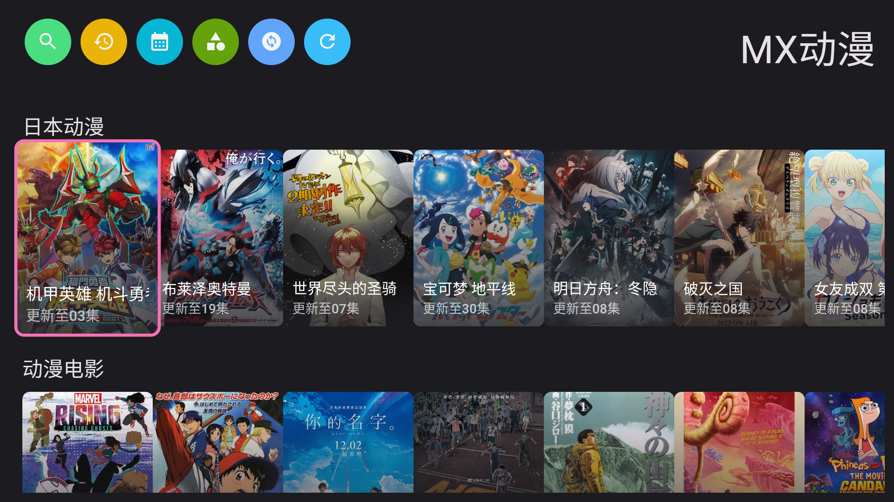
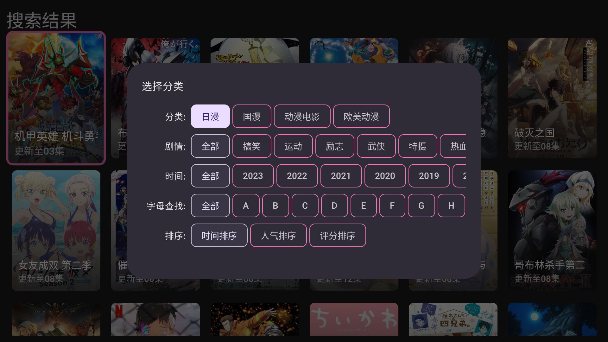
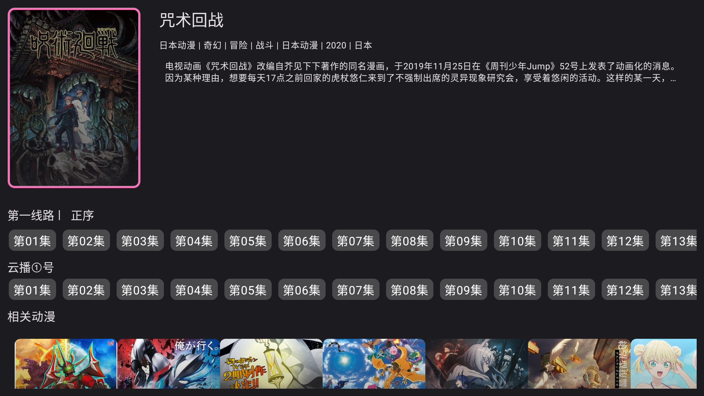

# 看动漫

原**樱花动漫**, 现已支持多数据源, 改名为 **看动漫**

Android TV端动漫app, 使用[jetpack compose](https://developer.android.com/training/tv/playback/compose)开发,
支持Android 5.0及以上设备

- [x] [樱花动漫](http://www.iyinghua.io)
- [x] [MX动漫](http://www.mxdm9.com)
- [x] [去看吧](https://k6dm.com)
- [x] [WE动漫](https://wedm.cc/)

# 已支持的功能
- [x] 播放记录
- [x] 番剧搜索
- [x] 更新时间表(需原网站支持)
- [x] 按类型搜索(需原网站支持)

# 不考虑添加倍速播放
 
# 操作
- 首页,搜索结果,分类搜索页面按菜单键刷新, 按返回键返回顶部
- 详情页点击视频封面刷新
- 播放页按菜单键显示剧集列表
- 分类搜索页长按显示筛选条件
- 播放历史和搜索历史长按可删除

# 截图

